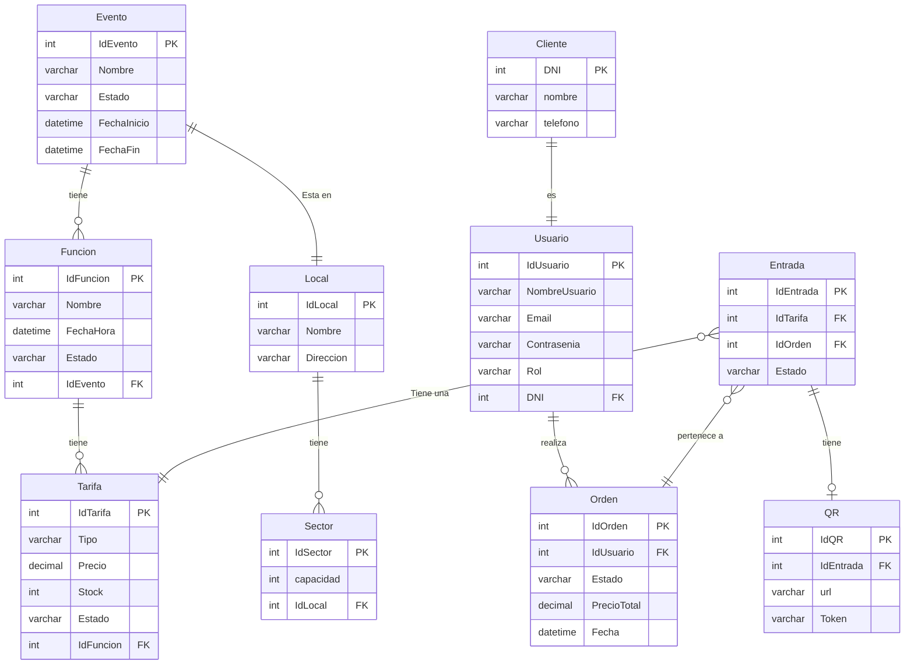

## DER

```mermaid
erDiagram

    Local {
        int IdLocal PK
        varchar Nombre
        varchar Direccion
    }

    Sector {
        int IdSector PK
        int capacidad
        int IdLocal FK
    }

    Evento {
        int IdEvento PK
        varchar Nombre
        varchar Estado
        datetime FechaInicio
        datetime FechaFin
    }

    Funcion {
        int IdFuncion PK
        varchar Nombre
        datetime FechaHora
        varchar Estado
        int IdEvento FK
    }

    Tarifa {
        int IdTarifa PK
        varchar Tipo
        decimal Precio
        int Stock
        varchar Estado
        int IdFuncion FK
    }

    Cliente {
        int DNI PK
        varchar nombre
        varchar telefono
    }

    Usuario {
        int IdUsuario PK
        varchar NombreUsuario
        varchar Email
        varchar Contrasenia
        varchar Rol
        int DNI FK
    }

    Orden {
        int IdOrden PK
        int IdUsuario FK
        varchar Estado
        decimal PrecioTotal
        datetime Fecha
    }

    Entrada {
        int IdEntrada PK
        int IdTarifa FK
        int IdOrden FK
        varchar Estado
    }


    QR {
        int IdQR PK
        int IdEntrada FK
        varchar url
        varchar Token
    }

    Local ||--o{ Sector : "tiene"

    Evento ||--o{ Funcion : "tiene"
    Evento ||--|| Local : "Esta en"

    Funcion ||--o{ Tarifa : "tiene"

    Cliente ||--|| Usuario : "es"
    Usuario ||--o{ Orden : "realiza"

    Entrada }o--|| Tarifa : "Tiene una"


    Entrada }o--|| Orden : "pertenece a"


    Entrada ||--o| QR : "tiene"
   
```

---