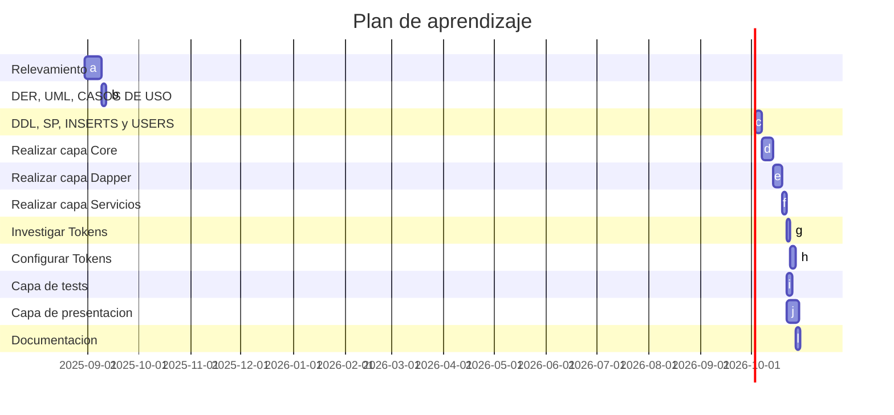

### **Lista de tareas**

| **Orden** | **Tarea**                             | **Duracion (hs)** | **Dependencias** |
|-------|-------------------------------------------|:-------------:|:------------:|
|a  |Realizar relevamiento (Que se debe hacer)      | 7             | -            |
|b	|Realizar el DER, diagrama de clases y casos de usos | 6	            | a            |
|c	|Realizar el DDL, SP, INSERTS y USERS                        | 7	            | b            |
|d	|Realizar capa Core	                            | 12	            | c            |
|e	|Realizar capa Dapper	                        | 8	            | d            |
|f	|Realizar capa Servicios	                    | 6	            | e            |
|g	|Investigar sobre JWT e implementarlo	        | 4	            | f            |
|h	|Configurar el JWT en el swagger  | 5	            | g            |
|i	|Realizar capa de Tests (XUnit)               | 6	            | f            |
|j  | Realizar capa de presentación (WebApi/Endpoints) | 15  |     d, e, f |
|l	|Documentacion	                                | 6       | i, h         |

### **Gantt**

